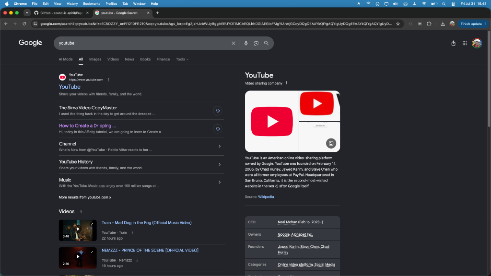
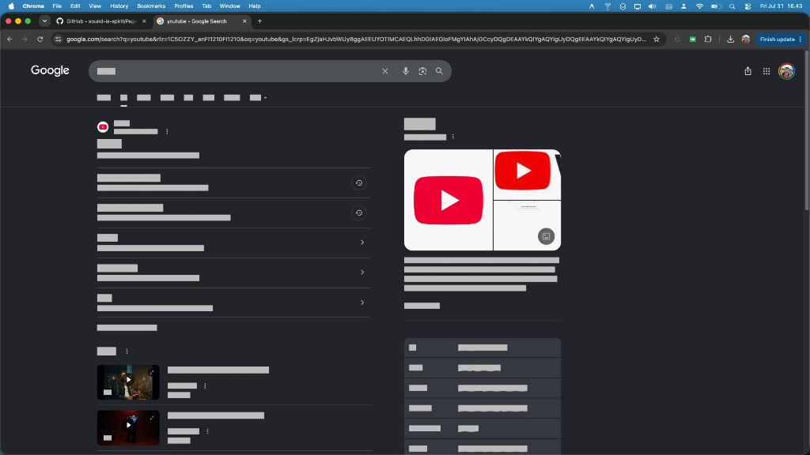

# WireDrafter

A Manifest V3 Chrome extension that turns any website into a **lo-fi wireframe**,
then lets you sketch on top of it. Strip the styling to see the structure, greek
the copy, and drop in your own containers and text boxes.

> **Status: v0.3.0.** The wireframe renderer and the floating toolbar work.
> WireDrafter grew out of [GreyOut](https://github.com/sound-is-spirit/GreyOut),
> a shipped screen-sharing redaction tool, and inherits its shadow-DOM plumbing.

## What it does

**Wireframe.** Flattens the page to a high-contrast blueprint: white surfaces,
black type, decoration stripped, media collapsed to flat grey plates, and
hand-drawn sketch outlines on structural elements. A measurement pass decides
which elements are worth outlining, so the result reads as a wireframe rather
than as a debug overlay.

**Grey bars.** Replaces text with grey bars sized to the real text, so you see
rhythm and hierarchy without reading words. Bars are painted as a background
gradient locked to each element's measured line-height, which touches no
layout-affecting property, so **the page does not shift**. Headings get a darker
bar so hierarchy survives.

**Sketching.** A floating toolbar adds **Containers** and **Text Boxes** on top
of the wireframe. Added elements drag with the pointer, resize natively from the
bottom-right corner, delete with the red **×**, and text boxes edit in place with
native `contenteditable`. Click to place, click again to type.

All of it works on single-page apps that constantly re-render, and reaches text
inside encapsulated web-component **Shadow DOM** controls, including closed ones.

| Before | Wireframe |
|:---:|:---:|
|  |  |

## Usage

- Click the toolbar icon to draft the current tab, or press
  **Ctrl/Cmd+Shift+Y**. Click again to restore the page.
- The icon turns green while a tab is drafted. Tabs you have not touched keep
  the plain icon.
- The floating panel appears top-right with **Wireframe** and **Grey bars**
  checkboxes, and buttons to add a Container or a Text Box.

## Permission model

WireDrafter requests `storage`, `activeTab` and `scripting`. It does **not**
request `<all_urls>`, and no content script is declared in the manifest.

Nothing runs anywhere until you invoke the extension on a tab. Clicking the
icon (or pressing the shortcut) grants `activeTab` for that one tab, and only
then is the renderer injected, into that tab's frames only. Consequences, all
deliberate:

- The install prompt does not ask to "read and change all your data on all
  websites".
- **State is per tab.** Drafting one tab leaves every other tab alone.
- **Draft mode does not survive a navigation or reload.** The injected renderer
  dies with the document, so the tab's state is cleared to match rather than
  showing a stale ON icon. Anything you added is lost with it.
- State lives in `chrome.storage.session` (in-memory, gone when Chrome closes),
  not `chrome.storage.local`. Persisting "draft mode is on" across a restart
  would relaunch you into a state whose renderer no longer exists.

## Architecture

The worker owns all state. Content modules are renderers that do what they are
told.

```
background.js          Service worker. Owns per-tab state in
                       chrome.storage.session, injects the content files on
                       demand (chrome.scripting, allFrames), pushes state,
                       drives the per-tab icon, clears a tab on navigation
                       or close. Touches no host-page code.

content/engine.js      Generic plumbing, knows nothing about any feature.
                       Shadow-DOM traversal (cached), stylesheet mirrored
                       into every root, a MutationObserver, node ownership
                       (WD.claim / WD.isOwnNode / WD.NOT_OWN), and a module
                       registry driven by a state machine.

content/wireframe.js   The renderer. Builds the wireframe CSS and runs the
                       measurement pass that decides what to outline.

content/toolbar.js     The UI. Mode checkboxes and element spawners. Top
                       frame only.
```

Modules declare their own flags, their own `active(state)` predicate, and their
own lifecycle edges at registration, so the engine never learns a feature's
vocabulary and a new module lands without editing it.

One `chrome.runtime` message carries state from worker to frames. There is no
cross-frame `postMessage`, no cross-world messaging to intercept, and no shared
storage key a second tab could read.

## How the rendering works

| Technique | What it does |
| --- | --- |
| **`filter: contrast(0)` on media** | The contrast filter is `C' = (C - 0.5) * amount + 0.5`, so at amount 0 every channel collapses to exactly 0.5. One GPU-accelerated declaration turns any image, video or canvas into a flat grey plate, with no per-image work. |
| **`border-image` from an inline SVG** | Sketch outlines come from a data-URI SVG decoded once and reused everywhere, not from a per-element `feTurbulence`/`feDisplacementMap` filter, which would rasterise one filter region per element and stall the compositor. Four seeded variants stop it looking mechanical. |
| **Background-gradient text bars** | Bars are a repeating gradient locked to measured line-height, sized and positioned to the measured text. No font is swapped, because no substitute font matches every glyph's advance width and a swap always reflows. |
| **Batched read/write tagging pass** | All `getBoundingClientRect` and `getComputedStyle` reads happen before any class write, so the browser performs one layout instead of one per element. |
| **`chrome.dom.openOrClosedShadowRoot()`** | Reaches into encapsulated **Shadow DOM** (even `mode:"closed"`) from the **ISOLATED world**, with no host-page injection and no prototype patching. |

## Privacy and data handling

- **No data collection.** The extension stores one small object per drafted tab
  in `chrome.storage.session`, in memory, discarded when Chrome closes. Nothing
  else is read, stored, or transmitted.
- **No network requests.** No `fetch`/XHR/WebSocket/beacon of any kind.
- **No remote code.** All logic ships in the package (MV3 compliant).
- **No host-page tampering.** Runs only in the extension's ISOLATED world; it
  does not inject into the page's `MAIN` world or patch native prototypes.
- **Permissions:** `storage`, `activeTab`, `scripting`. No `<all_urls>`, no
  `tabs`, no `cookies`, no `webRequest`.

## Install (unpacked)

1. Open `chrome://extensions`.
2. Enable **Developer mode** (top-right).
3. **Load unpacked**, then select this folder.
4. Open any page and click the toolbar icon (or **Ctrl/Cmd+Shift+Y**).

## Tuning the wireframe

If a site comes out too sparse or too busy, these constants at the top of
`content/wireframe.js` are the levers, not the algorithm:

- `MIN_W`, `MIN_H`, `MIN_AREA`: size floors below which an element is not
  outlined.
- `MAX_ASPECT`: rejects rules, dividers and spacer strips, which are lines
  pretending to be boxes.
- `SKETCH_MIN`: below this an element gets a crisp hairline instead of the
  `border-image`, which degenerates into corner ticks at small sizes.
- `NEST_TOL`, `NEST_AREA_RATIO`: duplicate-box suppression, by pixel tolerance
  and by area ratio respectively. The second is what catches padding-only
  wrapper chains.
- `MAX_BOXES`: pathological-page guard.
- In `roughRectPath`: `j` (corner jitter) and `over` (corner overshoot, the
  strongest hand-drawn tell).

## Scope and limitations

- **Visual only.** The real text remains in the DOM and page memory. DevTools,
  copy-paste and screen readers can still recover it. This is not a
  data-security control.
- **`<canvas>` / bitmap content is not reachable by CSS.** Text a page paints
  into a `<canvas>` cannot be turned into bars. SVG `<text>` is covered.
- **Restricted pages.** Content scripts cannot run on `chrome://` pages, the
  Chrome Web Store, or other extensions' pages. That is a Chrome policy; the
  icon flashes a badge instead of silently doing nothing.
- **Navigation ends the session.** Reloading or navigating a drafted tab clears
  it, along with anything you added. Inherent to on-demand injection, and
  correct for a tool you point at a page rather than leave running.
- **Sub-frames that navigate on their own** while draft mode is on are not
  re-drafted until the next toggle.
- **No export yet.** Screenshot the page. See the roadmap.

## Roadmap

- **Export.** PNG and SVG out of the tagged boxes.
- **Persisting a session** across reload.
- **More element types** in the toolbar (arrows, annotations).

## Testing

`test/suite.html` runs the module suite in a plain browser tab.
`test/verify_cdp.py` drives the content scripts over the Chrome DevTools
Protocol with the two `chrome.*` APIs stubbed, and covers the module contract,
the re-injection guard, ownership of added content, and teardown.

Note that Chrome 137 and later ignore `--load-extension`, so the packed
extension cannot be loaded headlessly. The worker plumbing (`activeTab`
granting, `executeScript` with `allFrames`, `storage.session`, the per-tab icon)
is not covered by either harness and needs a manual load-unpacked pass.

## Credits

Shadow-DOM plumbing inherited from
[GreyOut](https://github.com/sound-is-spirit/GreyOut).

## Licence

MIT. See [LICENSE](LICENSE).
